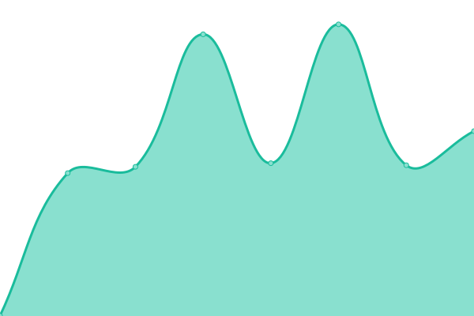

# [📈 Live Status](https://dzc34.github.io/test-upptime): <!--live status--> **🟩 All systems operational**

This repository contains the open-source uptime monitor and status page for [Fabrice Gangler](https://app.contrast-finder.org), powered by [Upptime](https://github.com/upptime/upptime).

With [Upptime](https://upptime.js.org), you can get your own unlimited and free uptime monitor and status page, powered entirely by a GitHub repository. We use [Issues](https://github.com/dzc34/test-upptime/issues) as incident reports, [Actions](https://github.com/dzc34/test-upptime/actions) as uptime monitors, and [Pages](https://dzc34.github.io/test-upptime) for the status page.

<!--start: status pages-->
<!-- This summary is generated by Upptime (https://github.com/upptime/upptime) -->
<!-- Do not edit this manually, your changes will be overwritten -->
<!-- prettier-ignore -->
| URL | Status | History | Response Time | Uptime |
| --- | ------ | ------- | ------------- | ------ |
|  [Asqatasun.org](https://asqatasun.org/) | 🟩 Up | [asqatasun-org.yml](https://github.com/dzc34/test-upptime/commits/HEAD/history/asqatasun-org.yml) | 

 798ms
     
 | 

<a href="https://dzc34.github.io/test-upptime/history/asqatasun-org">100.00%</a>
    

|  [Asqatasun demo](https://app.asqatasun.org/) | 🟩 Up | [asqatasun-demo.yml](https://github.com/dzc34/test-upptime/commits/HEAD/history/asqatasun-demo.yml) | 

 867ms
     
 | 

<a href="https://dzc34.github.io/test-upptime/history/asqatasun-demo">100.00%</a>
    

|  [Asqatasun documentation](https://doc.asqatasun.org/) | 🟩 Up | [asqatasun-documentation.yml](https://github.com/dzc34/test-upptime/commits/HEAD/history/asqatasun-documentation.yml) | 

 711ms
     
 | 

<a href="https://dzc34.github.io/test-upptime/history/asqatasun-documentation">100.00%</a>
    

|  [Asqatasun forum](https://forum.asqatasun.org/) | 🟩 Up | [asqatasun-forum.yml](https://github.com/dzc34/test-upptime/commits/HEAD/history/asqatasun-forum.yml) | 

 1299ms
     
 | 

<a href="https://dzc34.github.io/test-upptime/history/asqatasun-forum">100.00%</a>
    

<!--end: status pages-->

[**Visit our status website →**](https://dzc34.github.io/test-upptime)

## 📄 License

- Powered by: [Upptime](https://github.com/upptime/upptime)
- Code: [MIT](./LICENSE) © [Fabrice Gangler](https://app.contrast-finder.org)
- Data in the `./history` directory: [Open Database License](https://opendatacommons.org/licenses/odbl/1-0/)
